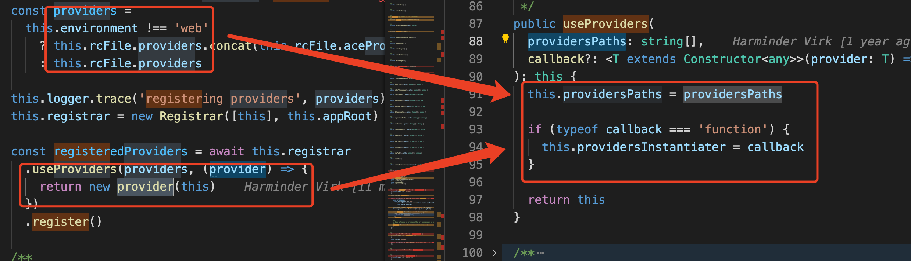
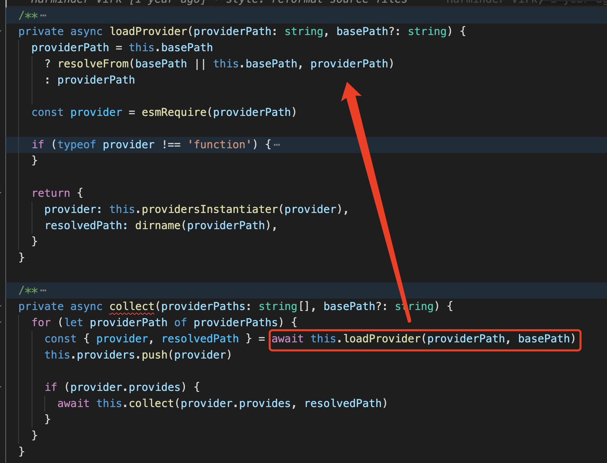
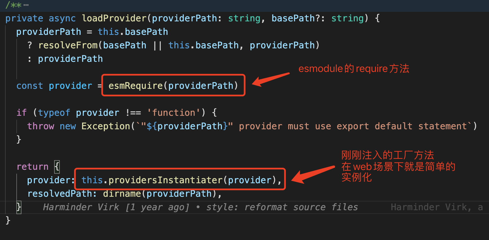

# provider的加载过程

本题承接第二题的内容，从wire中provider的内容继续深入。

## provider
https://docs.adonisjs.com/guides/adonisrc-file#providers

## 加载过程
先从wire看起，可以看到，在application里，provider加载的过程经历了register与boot两个过程

``` js {8-9}
private async wire() {
  if (this.wired) {
    return
  }
  this.wired = true

  await this.application.setup()
  await this.application.registerProviders()
  await this.application.bootProviders()
  await this.application.requirePreloads()
}
```

### Registrar

``` js
const providers =
  this.environment !== 'web'
    ? this.rcFile.providers.concat(this.rcFile.aceProviders)
    : this.rcFile.providers

// 核心注册的部分
this.registrar = new Registrar([this], this.appRoot)
const registeredProviders = await this.registrar
  .useProviders(providers, (provider) => {
    return new provider(this)
  })
  .register()
```

顾名思义，registrar是用来进行注册的（实际上，是专门用来注册并管理provider的）

实际上，Registrar支持多container的provider管理（constructor的第一个参数），不过此处没有看到真实的应用场景，暂且不论

#### useProviders



工厂方法，用于支持不同的provider初始化能力

猜测是不同的env下adonis的provider的load方式可能会有不同（方法在loadProvider中使用）？这里是直接返回一个provider的实例

这里采用了链式调用的写法，也是很有意思

#### register

``` js {9-10,12-13}
public async register() {
  if (this.collected) {
    return this.providers
  }
  this.collected = true

  // 收集（加载）
  await this.collect(this.providersPaths)

  this.providers.forEach((provider) => {
    if (typeof provider.register === 'function') {
      // 注册
      provider.register()
    }
  })

  return this.providers
}
```

核心的注册方法，register不再说明，就是provider的注册方法，主要说明一下collect方法

#### collect



这也是一个（非常）核心的方法

下半部分是递归provider的加载，不过现在好像没有看到使用场景，暂不讨论

主要看上半部分的load



通过这种方式，可以看到，this.providers（实际上这是个list）里已经包含了全部的provider的实例

换而言之，所有的provider已经被导入、实例化并且管理了起来

### boot

``` js
public async bootProviders(): Promise<void> {
  if (this.state !== 'registered') {
    return
  }

  this.state = 'booted'

  await this.profiler.profileAsync('providers:boot', {}, async () => {
    this.logger.trace('booting providers')
    await this.registrar.boot()
  })
}
```

很简单，调用了regitrar的boot

``` js
public async boot() {
  const providers = await this.register()

  for (let provider of providers) {
    if (typeof provider.boot === 'function') {
      await provider.boot()
    }
  }
}
```

也没有什么需要特殊说明的，就是每个provider的依次boot

**不过要特别注意的是，forof与await，每个provider实际上是依次boot的！！！所以，千万不要在前面的provider的boot中对后面的provider boot的结果有依赖**

### ready & shutdown
这两个生命周期的管理在application中进行，这里就不再说明了
