# 1. cli & 启动
## 入口
基本上，看一个项目的入口，一定是看其package.json

我们看一下hello-world的package.json

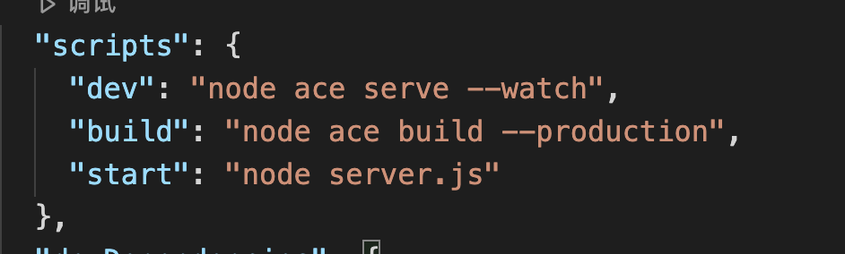

可以看到，框架的入口有两个：
1. 调试，采用dev，框架提供了一个ace的文件来实现其cli能力
1. 正式，采用start，使用ts编译后的版本
我们从dev开始看起

## ace
hello-world/ace

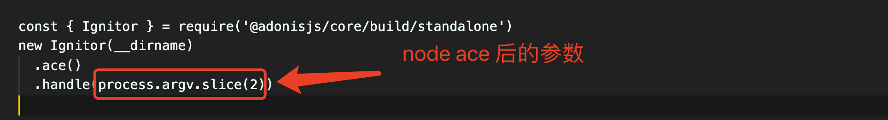

看一下结构，很简单，实际上将ace之后的内容作为参数，传入到Ignitor中

### Ignitor
core/standalone.ts

core/src/Ignitor/index.ts

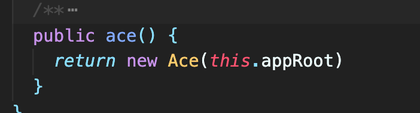

顾名思义，是个点火器，其中核心的是ace方法和httpServer方法，其中后者针对的是npm start的链路，这里不展开

可以看到，这里作为工厂函数创建了一个Ace的实例

### Ace
core/src/Ignitor/Ace/index.ts

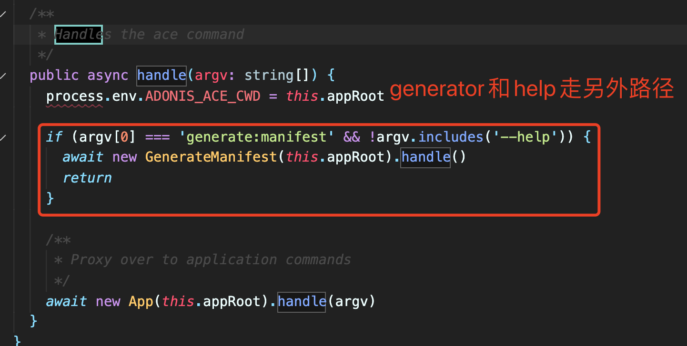

Ace的外层会根据传入的命令做一个预处理，如果是为了生成manifest文件，就走红框的链路，否则走正常执行链路

从代码上看，红框内的部分是的后添加的内容，原因放在manifest节进行说明，这里不再展开

我们先看正常链路的执行过程

### App(core中真正调用kernel的地方)
core/src/Ignitor/Ace/App/index.ts

App层是ace真正的application（应用管理层），内核的管理和命令的执行在这里进行

其中，用于处理命令的hanlde大概分两步：

#### 加载manifest

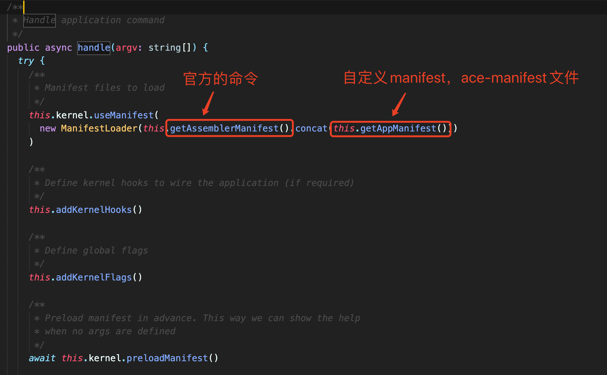

加载部分，比较简单，其中addKernelHooks有比较重要的额外作用，算是对用户编写的插件提供了一些语法糖和附加功能

其中ts的部分比较好理解，实际上就是支持用户通过ts编写的command

注入ioc的部分和command的支持相关，在manifest节内详细介绍

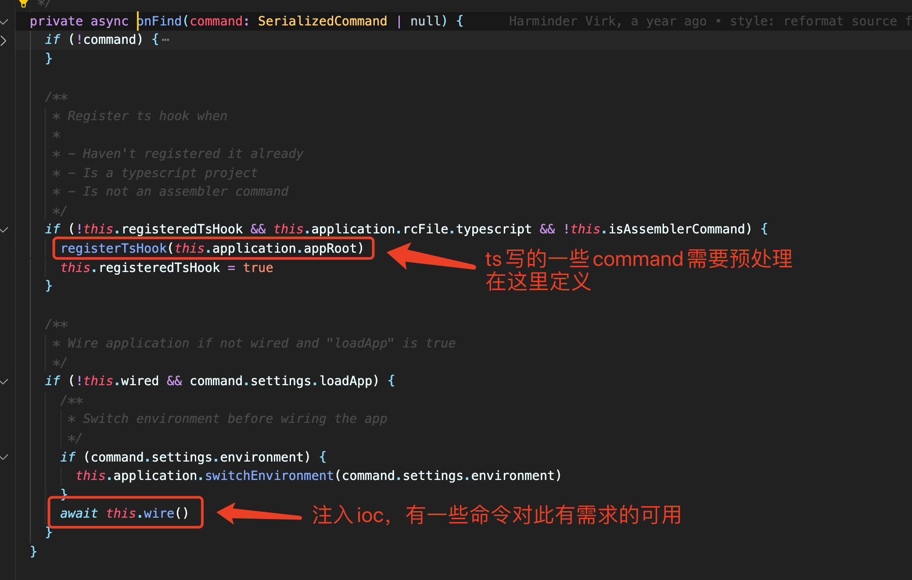

#### 查找并执行命令

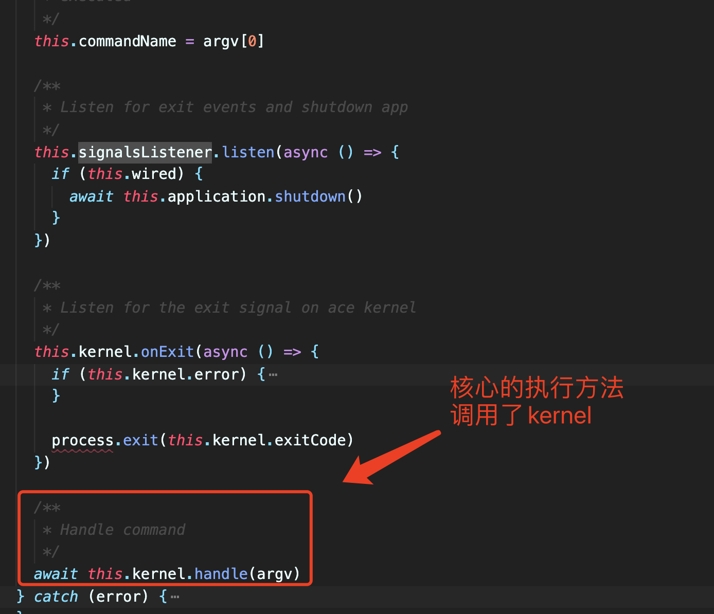

可以看到，这里调用了kernel的实例来处理command

### Kernel
ace/src/Kernel/index.ts

Kernel实际上就是命令行的处理类实例，内部管理了一条命令（比如，node ace xxxxx就是一条命令）的完整执行流程及生命周期

Kernel提供了一系列类似flag，getSuggestions的方法用于辅助，此处我们只从最核心的handle方法跟踪进入看起

#### handle

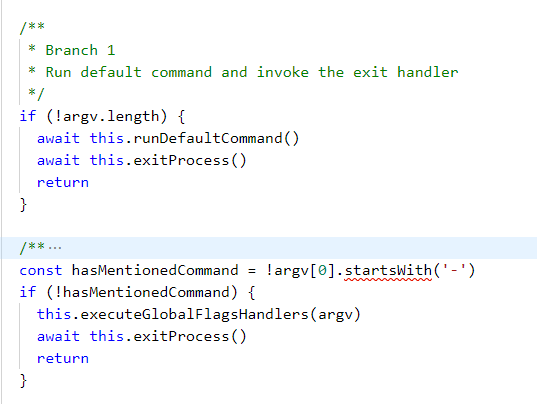

handle分为三个分支，前两个分支处理了 没有参数情况下的基础命令 和 带flag（比如说help）的命令情况，比较简单

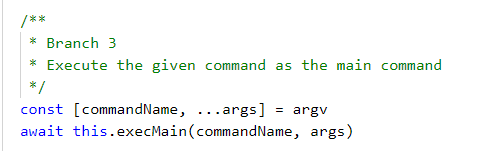

我们主要看branch 3，用来处理带参数情况的命令

从逻辑上来说，这里是我们正式执行命令的最终逻辑分支，这里也是被抽成了一个独立函数

#### execMain

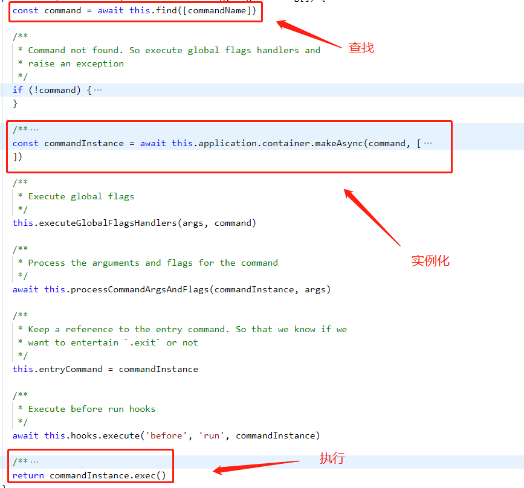

逻辑也比较清晰，查找 → 实例化 → （前置+钩子） →  执行

查找：find方法

实例化：makeAsync，是通过ioc提供的方法，根据command（类名称）来实例化了一个真正的command类；实际上，这里因为没有注入过，所以每个command都是同步生成的（所以用的是async方法）

执行：执行了command的exec方法，内部实际上也是通过ioc来做的，这里也不再展开了

#### Serve Command
以node ace serve为例，commandName为serve，其寻址实际是通过assembler下的ace-manifest.json来寻址的，寻址这块在manifest中详细介绍

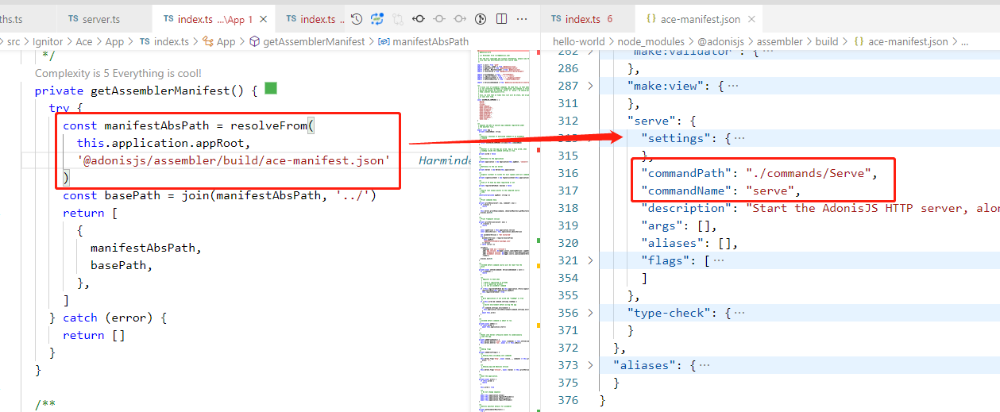

可以看到，最终定位到的位置是assembler\commands\Serve.ts

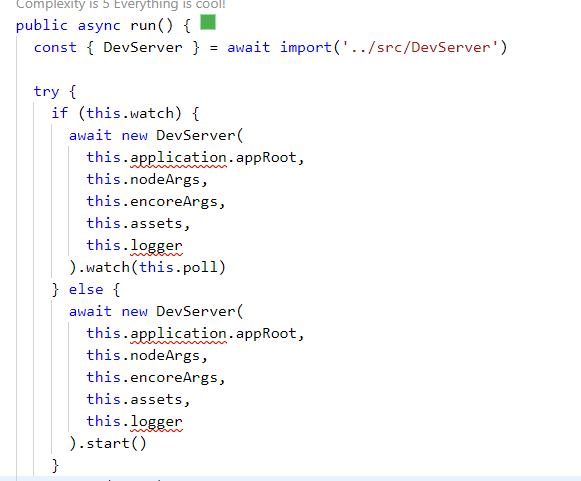

逻辑很简单，动态引入并执行了devserver，跟进去看一眼

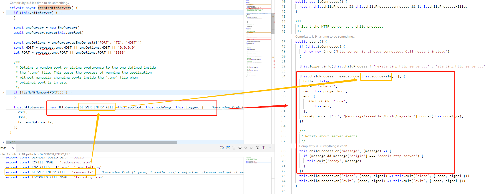

可以看到，最终实际上是通过子进程的方式，启动了hello-world下的server.ts

回到文章开头，我们可以发现，他和我们的另一条链路：正式服务启动（npm start）联系上了，只是两者一个是通过子进程启动，并且做了热更新和监控的能力，另一个是直接启动编译后的文件，用于生产环境

我们再来看下server.ts这条链路究竟做了什么

## Serve
hello-world/server.ts

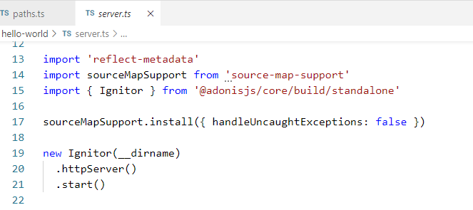

可以看到，此时走的是点火器的httpServer部分

### Ignitor.httpServer

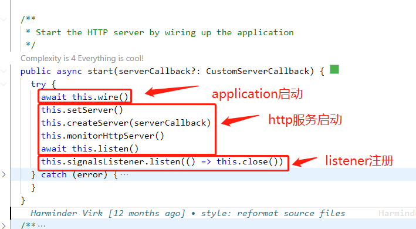

内容很简单，启动了application和server，并且注册了相应的listener处理错误

其中，application是服务的运行时管理，server提供了http服务的能力，通过这种方式，一个完整的运行时服务就启动了