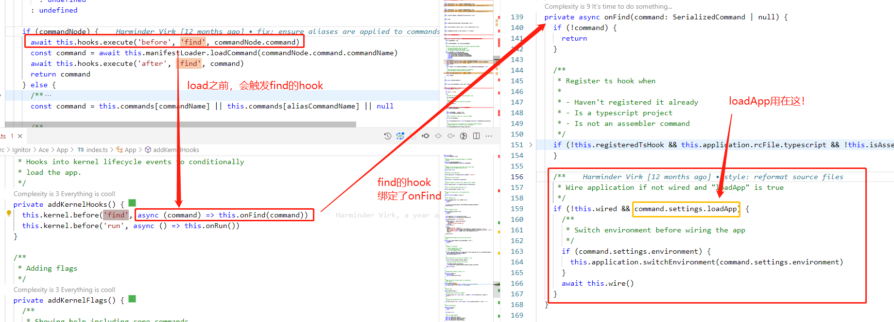
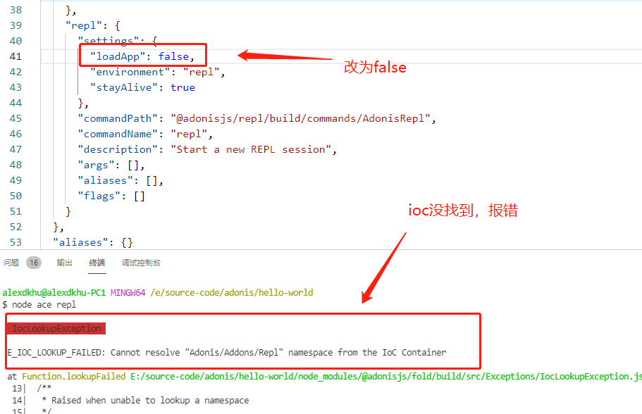

# 1.1 manifest

前文说过，command支持的命令是通过ace-manifest.json文件来定义的，本文将详细介绍一下该文件

## ace-manifest
hello-world/ace-manifest.json

``` json
{
  "commands": {
    ...
    "repl": {
      "settings": {
        "loadApp": true,
        "environment": "repl",
        "stayAlive": true
      },
      "commandPath": "@adonisjs/repl/build/commands/AdonisRepl",
      "commandName": "repl",
      "description": "Start a new REPL session",
      "args": [],
      "aliases": [],
      "flags": []
    }
    ...
  }
}
```

配置文件的内容还是很清晰的，对于每个command，核心的几个属性主要是：
1. commandName与commandPath，用于 实例化 特定名称的command
1. setting，指定相应的配置，实现对command的一些预处理

## Command实例化
command实例化的具体内容包含两部分，首先是根据manifest定位到对应的command，然后根据command名称定位到相应的类（import文件）并实例化，这个流程是在Ace中管理并进行的

### manifest加载
core/src/Ignitor/Ace/App/index.ts
``` js {3,9-12}
// line 271
this.kernel.useManifest(
  new ManifestLoader(this.getAssemblerManifest().concat(this.getAppManifest()))
)

// line 227
private getAssemblerManifest() {
  try {
    const manifestAbsPath = resolveFrom(
      this.application.appRoot,
      '@adonisjs/assembler/build/ace-manifest.json'
    )
    const basePath = join(manifestAbsPath, '../')
    return [
      {
        manifestAbsPath,
        basePath,
      },
    ]
  } catch (error) {
    return []
  }
}
```

@adonisjs/assembler/ace-manifest.json
``` json
"serve": {
  ...
  "commandPath": "./commands/Serve",
  "commandName": "serve",
  ...
}
```


我们回看manifest的加载流程，这里以官方命令为例，可以看到，在加载中首先解析了@adonis/assembler提供的ace-manifest文件，并将其通过ManifestLoader进行加载

这步相对简单，然后我们在真正执行时，再看怎么通过ManifestLoader进行定位并实例化

### 定位
前文提过，定位的部分在Kernel的find中，我们来看下代码

ace\src\Kernel\index.ts
``` js
// line 445
const commandNode = this.manifestLoader
  ? this.manifestLoader.hasCommand(commandName)
    ? this.manifestLoader.getCommand(commandName)
    : this.manifestLoader.hasCommand(aliasCommandName)
    ? this.manifestLoader.getCommand(aliasCommandName)
    : undefined
  : undefined

if (commandNode) {
  await this.hooks.execute('before', 'find', commandNode.command)
  const command = await this.manifestLoader.loadCommand(commandNode.command.commandName)
  await this.hooks.execute('after', 'find', command)
  return command
} else { ... }
```

可以看到使用ManifestLoader进行了get和load

``` js {4}
public getCommand(
  commandName: string
): { basePath: string; command: ManifestCommand } | undefined {
  const manifestCommands = this.getCommandManifest(commandName)

  const aliasCommandName = manifestCommands.aliases[commandName]
  return {
    basePath: manifestCommands.basePath,
    // 这里返回了ace-manifest里的command对象
    command:
      manifestCommands.commands[commandName] || manifestCommands.commands[aliasCommandName],
  }
}

private getCommandManifest(commandName: string) {
  return this.manifestFiles.find(({ commands, aliases }) => {
    const aliasCommandName = aliases[commandName]
    return commands[commandName] || commands[aliasCommandName]
  })
}
```

get中返回了commandName对应的command对象

``` js {3}
public async loadCommand(commandName: string): Promise<CommandConstructorContract> {
  const { basePath, command } = this.getCommand(commandName)!
  const commandConstructor = esmRequire(resolveFrom(basePath, command.commandPath))
  validateCommand(commandConstructor)
  return commandConstructor
}
```

esmRequire是为了支持babel打包的import，简单来说可以简单的理解为require

这里就通过之前find到的Command拿到了其真正对应的Constructor

### 实例化


掏出前文的图，实例化是通过ioc来做的，可以看到，这里的command实际上已经是对应的Constructor了，我们仔细看下makeAsync做了什么

#### makeAsync
fold\src\Ioc\index.ts

fold\src\Ioc\Injector.ts

``` js {6-12}
public async makeAsync(target: any, runtimeValues: any[]) {
  if (!this.isNewable(target)) {
    return target
  }

  return new target(
    ...(await this.resolveAsync(
      target.name,
      this.getInjections(target, 'instance'),
      runtimeValues
    ))
  )
}
```

一路跟进去，可以看到，实际就是通过target实例化了一个新的类

## Command预处理
在command中，还有一个重要的组成部分是Setting

其中keepAlive和environment比较好理解，loadApp则是后续添加的，主要是为了支持command对ioc能力的支持

### ioc预处理
对应setting.loadApp，先看下其使用，就能更好的理解他的使用场景了



可以看到，loadApp是在command被load（真正的被require进来之前）使用的

在前置的onFind里做了两件事：一是注册了ts的compiler，这个无需解释，很容易理解，就是支持ts方法编写command；二是loadApp，如果这个参数被设置了，那么就会执行wire

### wire
core\src\Ignitor\Ace\App\index.ts

``` js {8-11}
private async wire() {
  if (this.wired) {
    return
  }

  this.wired = true

  await this.application.setup()
  await this.application.registerProviders()
  await this.application.bootProviders()
  await this.application.requirePreloads()
}
```

可以看到，做的事情就是加载了application（实际上，是加载了application里的provider）

这样，在command里就可以使用adonis提供的ioc能力了

### 验证
以开头的repl命令为例，可以看到，repl需要使用loadApp

``` json {3}
"repl": {
  "settings": {
    "loadApp": true,
    "environment": "repl",
    "stayAlive": true
  },
  "commandPath": "@adonisjs/repl/build/commands/AdonisRepl",
  "commandName": "repl",
  "description": "Start a new REPL session",
  "args": [],
  "aliases": [],
  "flags": []
}
```

说明repl里使用了ioc

如果我们将loadApp去掉，那么执行node ace repl一定会报错


